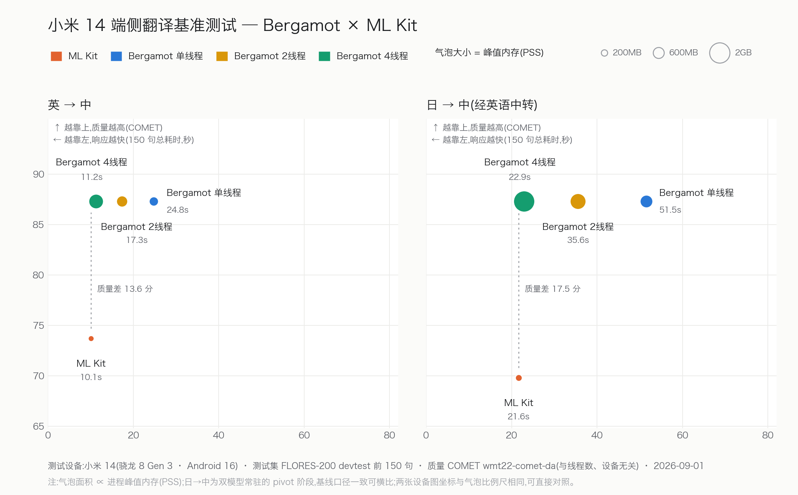
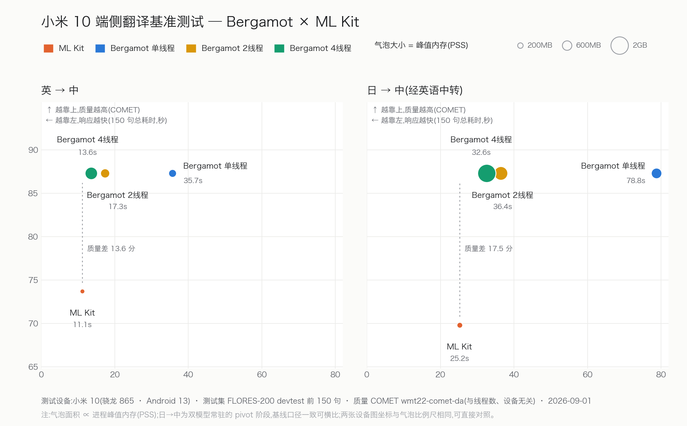

# v0.1.0：历史起点

源码 tag：`v0.1.0`，提交 `d447381b1259a8f101a91390dd8950ad7080c84e`。这是本项目的初版 Android 移植，**不是原封不动的 Mozilla / Bergamot 上游**：它已包含 ruy SDOT 内核编译修复和 CPU 指令集检测适配。没有更早的版本可比，本页只记录起点数据。

本版没有独立的原始记录目录：原生性能与 v0.2.0 同场次配对采集，原始样本集中保存在 [v0.2.0 归档](../v0.2.0/raw/results.json)中 `version = v0.1.0` 的条目，避免复制两份同场次数据。索引见 [`index.json`](index.json)。

## 小米 10 原生基准

小米 10 / 骁龙 865 / Android 13，FLORES-200 前 200 条。

| 场景 | 首次耗时中位数 | 首遍峰值 RSS 中位数 |
|---|---:|---:|
| 英→中，1 worker | 7.208 s | 322.969 MiB |
| 英→中，4 workers | 3.249 s | 947.617 MiB |
| 日→英→中，1 worker | 16.077 s | 483.422 MiB |

英→中 2 workers 有一次 SIGABRT，不能作为完整三轮基线。测试条件、热态表现和限制见 [v0.2.0 配对报告](../v0.2.0/README.md)。

## 小米 14：初版 → v0.3.0 对照

[v0.1.0 → v0.3.0 默认参数对照](../v0.3.0/README.md#v010--v030-默认参数对照参考)已完成固定八场景、两版本、三轮共 48 个进程。两版均不等待频率恢复，属于动态调频下的性能参考，不是严格回归基线；本版两个 Blocking 场景出现输出哈希变化，原始样本与失败标记均保留在 [v0.3.0 归档](../v0.3.0/raw/mi14/initial/results.json)。不覆盖上方小米 10 记录。

## 与 Google ML Kit 的历史评测

本节保存 v0.1.0 阶段的质量分数、真机图表与评测方法，测试对象为当时的 Android 移植和 Google ML Kit 端侧翻译。**这些数据不是后续版本的评测结果，也不是与云端 Google 翻译的比较。** 它使用 150 条语料、测量 app PSS，与其他版本 200 条语料的原生引擎 RSS 口径不同，两者不能直接拼成新版与 ML Kit 的性能对比。

FLORES-200 devtest 前 150 条，COMET（`wmt22-comet-da` × 100），越高越好。

| 方向 | Google ML Kit | Mozilla 模型 / Bergamot |
|---|---:|---:|
| 英→中 | 73.7 | **87.3** |
| 日→中 | 69.8 | **87.3** |

在这批语料和被测模型上，Mozilla 模型的 COMET 得分高于 ML Kit。结论不外推到其他语向、模型版本或全部使用场景，也不证明后续运行时优化完全不影响质量。

图表保留原样，包含历史质量、速度与内存数据。

当时的单线程测试中，Bergamot 完成同一批翻译的总耗时为 ML Kit 的约 2.4–3.2 倍，峰值 PSS 约为 2.4 倍，日→中双模型常驻时约为 3.4 倍。4 线程翻译速度已接近 ML Kit，但峰值 PSS 约为 Bergamot 单线程的 2.5 倍。这些是旧版的取舍，不能用来描述后续版本。

设备间差异也较明显：单线程下，骁龙 8 Gen 3 相较骁龙 865 的英→中翻译速度高约 44%（总耗时 24.8 s / 35.7 s）、日→中高约 53%（51.5 s / 78.8 s）。两台设备上的 ML Kit 速度差距较小。

| 维度 | 本次历史测试的规则 |
|---|---|
| 测试集 | [FLORES-200](https://github.com/facebookresearch/flores) devtest 前 **150 条**；英、日、中内容对齐，使用人工中文参考译文。当前仓库语料为 200 条，但本节分数和图表未随之重测 |
| 质量 | [COMET](https://github.com/Unbabel/COMET) `wmt22-comet-da` × 100；两个引擎使用同一批源文、同一份参考，主机侧统一评分。历史记录另以中文分词 BLEU 交叉验证，结论一致 |
| 速度 | 基准 app 内记录全集总耗时；ML Kit 逐条调用，Bergamot 整批输入；均不含模型下载，Bergamot 计时包含模型加载 |
| 内存 | 每 250 ms 采样一次 app 进程 PSS，取各阶段峰值；不是 native RSS |
| 运行隔离 | 每种引擎/线程配置使用独立进程；日→中双方都经英语中转，ML Kit 内部处理，Bergamot 使用 pivot |

基准 app 的启动和报告入口见[真机验证](../../../docs/benchmarking.md#真机验证)。Marian 持有进程级全局状态，不同线程配置需要分进程运行。当前 app 的 200 条测试不能直接复现本节的 150 条汇总。

新版与 ML Kit 的完整复测应固定设备、模型版本、语料、参考译文、线程配置、计时窗口和 PSS 采样方法，并同时记录速度、内存和 COMET。保存原始输出和测试条件，新增带版本的报告，不覆盖本页历史记录。原生引擎的版本回归继续使用[固定八场景协议](../README.md#固定测量口径)。
