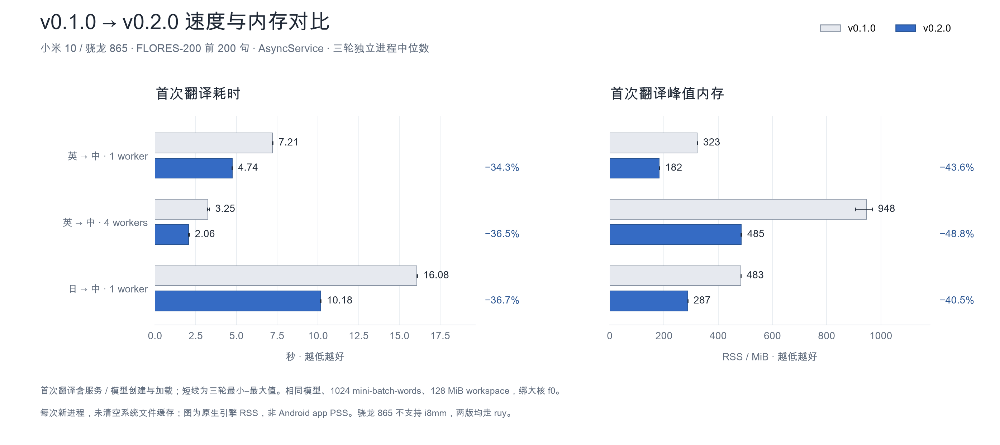

# v0.1.0 → v0.2.0 真机性能对比

本页保留两个正式 tag 的历史原生引擎测量,不把各阶段优化的百分比相加。测量日期:2026-09-05。当前本地版本参考见 [v0.3.0](../v0.3.0/README.md)。



上图保留原始耗时口径；下表改为翻译速度，按同一批 200 条源文除以耗时中位数换算。计时仍含模型加载，没有重新测量或改动原始数据。

| 场景 | 首次翻译速度 v0.1.0 → v0.2.0 | 速度倍率 / 提升 | 峰值 RSS v0.1.0 → v0.2.0 | 峰值降低 |
|---|---|---|---|---|
| 英→中 · 1 worker | 27.75 → 42.23 条/秒 | 1.52× / +52.2% | 323 → 182 MiB | 43.6% |
| 英→中 · 4 workers | 61.55 → 96.95 条/秒 | 1.58× / +57.5% | 948 → 485 MiB | 48.8% |
| 日→中 · 1 worker | 12.44 → 19.64 条/秒 | 1.58× / +57.9% | 483 → 287 MiB | 40.5% |

**未纳入图表的场景**:英→中 2 worker 在 v0.1.0 的三轮中有一轮 SIGABRT(退出码 134),其余两轮完成;v0.2.0 三轮均完成。因此不以旧版的两次成功样本代表完整三轮基线,也不把失败计作零耗时或零内存。全部记录见 results.json。本轮未进一步定位崩溃根因。

**运行条件**:电池温度 29.5–33.5°C;采样起止的大核频率上限始终为 A77 2,246,400 kHz / prime 2,745,600 kHz。它们是频率上限,不等同于持续锁定的实际运行频率。

热态速度供参考（先取每进程后两遍耗时的中位数，再取三进程中位数，最后按 200 条换算；不与首次速度混用）：

| 场景 | v0.1.0 | v0.2.0 |
|---|---|---|
| 英→中 · 1 worker | 29.00 条/秒 | 44.21 条/秒 |
| 英→中 · 4 workers | 69.89 条/秒 | 115.28 条/秒 |
| 日→中 · 1 worker | 13.11 条/秒 | 20.58 条/秒 |

## 测量口径

- **设备**:小米 10 / 骁龙 865,两版均走 ruy。该设备没有 i8mm,本图不代表新芯片上的 SMMLA 收益。
- **版本**:v0.1.0 `d447381` 与 v0.2.0 `db1ccfd`;从 tag 导出引擎源码,用同一份 [测量程序](../../tools/version-bench/main.cpp) 构建。只替换 smoke CLI,旧版 CMake 额外开放 Android smoke 目标,没有改动引擎算法或修复旧版缺陷。v0.1.0 是本项目初版 Android 移植,不是未修改的 Mozilla 上游。
- **构建**:NDK 29.0.13113456,Release,arm64-v8a / Android API 28,`BUILD_ARCH=armv8-a`,静态 C++ 运行库。版本 commit、引擎 tree、二进制和测量程序 SHA-256 均保留在原始数据中。
- **负载**:相同 Mozilla 官方 enzh / jaen 模型与 FLORES-200 devtest 前 200 句。模型文件、语料哈希及完整 YAML 参数见原始数据。日→中由 ja→en→zh 中转,两个模型同时驻留。
- **参数**:与 AAR 默认值一致:mini-batch-words 1024、workspace 128、beam 1、shortlist 开启、alignment soft。使用 AsyncService,结果缓存关闭。所有进程 `taskset f0` 绑定大核,不测 Android UI/JNI 开销。
- **重复**:每场景每版本 3 个独立进程,版本顺序 AB / BA / AB;每进程运行 3 遍,进程间等待 4 秒。图表取三轮首次翻译的中位数,短线为最小–最大值。失败进程不重试、不删除;只有两版都完整跑完三轮的场景进入对比图。
- **耗时**:从创建服务开始,包含模型创建、懒加载和第一次翻译,不含模型下载、进程启动、读取输入和输出哈希计算。系统文件缓存未清空,因此不能称为首次安装或冷磁盘启动耗时。另保存后两遍的热态耗时供核对。
- **内存**:首次翻译完成后读取 `/proc/self/status` 的 VmHWM,单位 MiB(内核 KiB ÷ 1024);另存 VmRSS。它是原生引擎进程 RSS,不与历史 app PSS 或不同参数的阶段实验直接相减。
- **质量范围**:本轮只测性能,没有重新计算 COMET。两个版本的输出哈希存在差异,本图不声称跨版本译文逐字节相同;组批顺序修复及既有 async 非确定性都可能改变输出。原始数据保留每遍输出字节数与哈希。

## 数据与复现

- [逐轮原始数据](results.json):含失败记录、运行命令、温度、频率上限和版本身份。
- [原始耗时/RSS 中位数与降幅](summary.json)：历史字段 `reduction_pct` 保留原意，不改成速度。页面速度倍率 = `旧版耗时 / 新版耗时`，速度提升 = `(倍率 − 1) × 100%`。
- [绘图脚本](../../tools/version-bench/plot.py):Python 3 + Matplotlib,导出本页 PNG。中文字体默认使用 macOS Arial Unicode。

复测需连接同型号 Android 设备,并准备原始数据 YAML 所指向的模型。脚本复用 `/data/local/tmp/bg/` 下的 `config-mbw1024.yml`、`config-jaen.yml`、`eng200.txt`、`jpn200.txt`,语料必须与仓库 assets 一致;jaen 配置会统一为 1024。

```bash
python3 tools/version-bench/build.py --ndk "$ANDROID_NDK_HOME" --output /tmp/version-bench-build
python3 tools/version-bench/run.py --adb "$ANDROID_HOME/platform-tools/adb" \
  --serial YOUR_DEVICE --build-root /tmp/version-bench-build \
  --output /tmp/version-bench-results/results.json
# 历史数据不可覆盖；新测量请保存到新版本目录。仅重绘现有归档：
python3 tools/version-bench/plot.py
```
